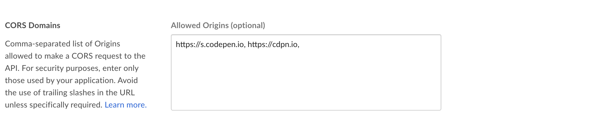

[Box Content Preview](https://docs.box.com/docs/box-content-preview)
====================================================================
The Box Content Preview Javascript UI Kit allows developers to easily embed high quality and interactive previews of Box files in their desktop or mobile web application. The library fetches information about the file and its converted representations through the Box API, chooses the appropriate viewer for the file type, dynamically loads the necessary static assets and file representations, and finally renders the file. Box Content Preview also allows previews of multiple files to be loaded in the same container and exposes arrows to navigate between those files.

This UI Kit powers Preview in the main Box web application as well as the 'expiring embed' Box API endpoint.

Browser Support
---------------
* Desktop Chrome, Firefox, Safari, Edge, and Internet Explorer 11
* Limited support for mobile web - previews will render but some controls may not work

If you are using Internet Explorer 11, which doesn't natively support promises, include a polyfill.io script (see sample code below) or a Promise library like Bluebird.

Current Version
---------------
* Version: v0.124.0
* Locale: en-US

https://cdn01.boxcdn.net/platform/preview/0.124.0/en-US/preview.js
https://cdn01.boxcdn.net/platform/preview/0.124.0/en-US/preview.css

Supported Locales
-----------------
To use a different locale, replace `en-US` in the URLs above with any of the following supported locales.

`en-AU`, `en-CA`, `en-GB`, `en-US`, `da-DK`, `de-DE`, `es-ES`, `fi-FI`, `fr-CA`, `fr-FR`, `it-IT`, `ja-JP`, `ko-KR`, `nb-NO`, `nl-NL`, `pl-PL`, `pt-BR`, `ru-RU`, `sv-SE`, `tr-TR`, `zh-CN`, `zh-TW`

Supported File Types
--------------------
Box Content Preview supports 100+ file types, including most document and image formats, HD video, 3D models, 360-degress images, and 360-degree videos. You can find the full list of supported file types at https://community.box.com/t5/Managing-Your-Content/What-file-types-and-fonts-are-supported-by-Box-s-Content-Preview/ta-p/327#FileTypesSupported.

Usage
-----
You can self-host the Box Content Preview UI Kit or reference the versions available on Box's CDN.

```html
<!DOCTYPE html>
<html lang="en-US">
<head>
    <meta charset="utf-8" />
    <title>Box Content Preview Demo</title>

    <!-- polyfill.io only loads a Promise polyfill if your browser needs one -->
    <script src="https://cdn.polyfill.io/v2/polyfill.min.js?features=Promise"></script>

    <!-- Latest version of Preview SDK for your locale -->
    <script src="https://cdn01.boxcdn.net/platform/preview/0.124.0/en-US/preview.js"></script>
    <link rel="stylesheet" href="https://cdn01.boxcdn.net/platform/preview/0.124.0/en-US/preview.css" />
</head>
<body>
    <div class="preview-container" style="height:400px;width:575px"></div>
    <script>
        var preview = new Box.Preview();
        preview.show('93392244621', 'EqFyi1Yq1tD9mxY8F38sxDfp73pFd7FP', {
    	    container: '.preview-container'
        });
    </script>
</body>
</html>
```

CORS (Cross-Origin Resource Sharing)
------------------------------------
For security purposes, you must whitelist your application's HTTP origin, omitting any trailing slash, in the configuration section of the Developer Console. For example, CodePen's domain is whitelisted for the demo application below.



Demo
----
View a demo and sample code on CodePen - http://codepen.io/box-platform/pen/rmZdjm.

Initialization
--------------
```javascript
var preview = new Box.Preview();
preview.show(fileId, accessToken, { options });
```
Where `fileId` is a string `Box_File` id and `accessToken` is a Box API access token.


Parameters & Options
-------
```javascript
var preview = new Box.Preview();
preview.show(fileId, accessToken, {
    container: '.preview-container',
    sharedLink: 'https://app.box.com/v/foo',
    sharedLinkPassword: 'bar',
    collection: [FILE_ID, '123', '234', ...],
    header: 'light',
    logoUrl: 'http://i.imgur.com/xh8j3E2.png',
    showAnnotations: true,
    showDownload: true
});
```
| Parameter | Description |
| --- | --- |
| fileId | Box file ID |
| accessToken | Either a string auth token or a token generator function, see below for details |

| Option | Default | Description |
| --- | --- | --- |
| container | document.body | DOM node or selector where Preview should be placed |
| sharedLink |  | Shared link URL |
| sharedLinkPassword |  | Shared link password |
| collection |  | List of file IDs to iterate over for previewing |
| header | 'light' | String value of 'none' or 'dark' or 'light' that controls header visibility and theme |
| logoUrl |  | URL of logo to show in header |
| showAnnotations | false | Whether annotations and annotation controls are shown. This option will be overridden by viewer-specific annotation options if they are set. |
| showDownload | false | Whether download button is shown |
| useHotkeys | true | Whether hotkeys (keyboard shortcuts) are enabled |

Access Token
------------
Box Content Preview needs an access token to make Box API calls. You can either get an access token from the token endpoint (https://docs.box.com/reference#token) or generate a developer token on your application management page (https://blog.box.com/blog/introducing-developer-tokens/).

Viewers
-------
The name of a viewer can be one of the following `Document`, `Presentation`, `MP3`, `MP4`, `Dash`, `Image`, `Text`, `SWF`, `Image360`, `Video360`, `Model3d`, `CSV`, `Markdown`. Call `preview.getViewers()` to get the list of possible viewers.

Additional Methods
------------------
`preview.hide()` hides the preview.

`preview.updateCollection(/* Array[file ids] */ collection)` updates the collection to navigate through. Assumes the currently visible file is part of this new collection.

`preview.getCurrentCollection()` returns the current collection if any.

`preview.getCurrentFile()` returns the current file being previewed if any. The file object structure is the same as returned by the [Box API](https://docs.box.com/reference#files).

`preview.getCurrentViewer()` returns the current viewer instance. May be undefined if the viewer isn't ready yet and waiting on conversion to happen.

`preview.enableViewers(/* String|Array[String] */ viewers)` enables one or more viewers based on VIEWERNAME.

`preview.disableViewers(/* String|Array[String] */ viewers)` disables one or more viewers based on VIEWERNAME. Viewers can also be disabled by setting `disabled: true` on the specific viewer option inside options.

`preview.enableHotkeys()` enables hotkeys (keyboard shortcuts).

`preview.disableHotkeys()` disables hotkeys (keyboard shortcuts).

`preview.print()` prints the file if printable.

`preview.download()` downloads the file if downloadable.

`preview.resize()` resizes the current preview if applicable. This function only needs to be called when preview's viewport has changed while the window object has not. If the window is resizing, then preview will automatically resize itself.

`preview.getViewers()` lists all the available viewers.

`preview.prefetchViewers()` prefetches the static assets for all the available viewers for browser to cache for performance.

Events
------
The preview object exposes `addListener` and `removeListener` for binding to events. Event listeners should be bound before `show()` is called, otherwise events can be missed.

```javascript
var preview = new Box.Preview();
var listener = (value) => {
    // Do something with value
};

// Attach listener before calling show otherwise events can be missed
preview.addListener(EVENTNAME, listener);

// Show a preview
preview.show(...);

// Remove listener when appropriate
preview.removeListener(EVENTNAME, listener);
```

EVENTNAME can be one of the following

* `viewer` event will be fired when we have the viewer instance first available. This will be the same object that is also a property included in the `load` event. Preview fires this event before `load` so that clients can attach their listeners before the `load` event is fired.

* `load` event will be fired on every preview load when `show()` is called or if inter-preview navigation occurs. The event data will contain:
```javascript
  {
      error: 'message', // Error message if any error occurred while loading
      viewer: {...},    // Instance of the current viewer object if no error occurred
      metrics: {...},   // Performance metrics
      file: {...}       // Box file object with properties defined in file.js
  }
```
* `navigate` event will be fired when navigation happens. The event includes the file ID of the file being navigated to, and this event will fire before `load`.

* `notification` event will be fired when either the preview wrapper or one of the viewers wants to notify something like a warning or non-fatal error. The event data will contain:
```javascript
  {
      message: 'message', // Message to show
      type: 'warning'    // 'warning', 'notice', or 'error'
  }
```

* `viewerevent` Each viewer will fire its own sets of events. For example, the Image viewer will fire `rotate` or `resize`, etc. while other viewers may fire another set of events. The preview wrapper will also re-emit events at the preview level, with event data containing:
```javascript
  {
      event: EVENTNAME,         // Event name
      data: DATA,               // Event data object
      viewerName: VIEWERNAME,   // Name of the viewer. See VIEWERNAME above
      fileId: fileId            // The file id
  }
```

### Example event usage
```javascript
preview.addListener('viewer', (viewer) => {
    viewer.addListener('rotate', () => {
        // Do something when a viewer rotates a preview
    });
});

preview.addListener('load', (data) => {
    var viewer = data.viewer;
    viewer.addListener('rotate', () => {
        // Do something when a viewer rotates a preview
    });
});

preview.addListener('viewerevent', (data) => {
    if (data.viewerName === 'Image') {
        if (data.event === 'rotate') {
            // Do something when an image preview is rotated
        }
    } else if (data.viewerName === 'Image360') {
        if (data.event === 'rotate') {
            // Do something different when a 360-degree image is rotated
        }
    } else {}
});

preview.addListener('rotate', (data) => {
    if (data.viewerName === 'Image') {
        // Do something when an image preview is rotated
    } else if (data.viewerName === 'Image360') {
        // Do something different when a 360-degree image is rotated
    } else {}
});
```

Development Setup
-----------------
1. Install Node v6.10.0 or higher.
2. Install yarn package manager `https://yarnpkg.com/en/docs/install`. Alternatively, you can replace any `yarn` command with `npm`.
2. Fork the upstream repo `https://github.com/box/box-content-preview`.
3. Clone your fork locally `git clone git@github.com:[YOUR GITHUB USERNAME]/box-content-preview.git`.
4. Navigate to the cloned folder `cd box-content-preview`
5. Add the upstream repo to your remotes `git remote add upstream git@github.com:box/box-content-preview.git`.
6. Verify your remotes are properly set up `git remote -v`. You should pull updates from the Box repo `upstream` and push changes to your fork `origin`.
7. Install dependencies `yarn install`
8. Test your first build! `yarn run build`
9. To automatically rsync files after a Webpack build, add a build/rsync.json file with a `location` field. This file should look like:
```
{
    "location": "YOUR_DESIRED_RSYNC_LOCATION_HERE"
}
```

While Developing
----------------
Install the following plugins in your preferred editor

* Editor Config (standardizes basic editor configuration)
* ESLint (Javascript linting)
* Stylelint (CSS linting)

### Yarn commands

* `yarn run build` to generate resource bundles and JS webpack bundles.
* `yarn run watch` to only generate JS webpack bundles on file changes.
* `yarn run test` launches karma tests with PhantomJS.
* `yarn run test -- --src=PATH/TO/SRC/FILENAME` launches test only for `src/lib/PATH/TO/SRC/__tests__/FILENAME-test.js` instead of all tests. For example, `yarn run test -- --src=viewers/media/MediaBase` launches tests for `src/lib/viewers/media/__tests__/MediaBase-test.js`. This also works for directories, e.g. `yarn run test -- --src=viewers/doc/`.
* `yarn run debug` launches karma tests with PhantomJS for debugging. Open the URL mentioned in the console.
* `yarn run debug -- --src=path/to/src/FILENAME` launches debugging for `src/lib/path/to/src/__tests__/FILENAME-test.js` instead of all tests. Open the URL mentioned in the console.

For more script commands see `package.json`. Test coverage reports are available under reports/coverage.

### Config files

* .babelrc - https://babeljs.io/docs/usage/babelrc/
* .conventional-changelog-lintrc - https://github.com/marionebl/conventional-changelog-lint
* .editorconfig - http://editorconfig.org/
* .eslintignore - http://eslint.org/docs/user-guide/configuring#ignoring-files-and-directories
* .eslintrc - http://eslint.org/docs/user-guide/configuring
* .gitignore - https://git-scm.com/docs/gitignore
* .stylelintrc - https://stylelint.io/user-guide/configuration/
* .travis.yml - https://docs.travis-ci.com/user/customizing-the-build
* browserslist - https://github.com/ai/browserslist
* postcss.config.js - https://github.com/postcss/postcss-loader

Support
-------
Need to contact us directly? Email oss@box.com and be sure to include the name of this project in the subject.

Copyright and License
---------------------
Copyright 2016-2017 Box, Inc. All Rights Reserved.

Licensed under the Box Software License Agreement v.05162017.
You may not use this file except in compliance with the License.
You may obtain a copy of the License at

   https://github.com/box/box-content-preview/blob/master/LICENSE

Unless required by applicable law or agreed to in writing, software
distributed under the License is distributed on an "AS IS" BASIS,
WITHOUT WARRANTIES OR CONDITIONS OF ANY KIND, either express or implied.
See the License for the specific language governing permissions and
limitations under the License.
