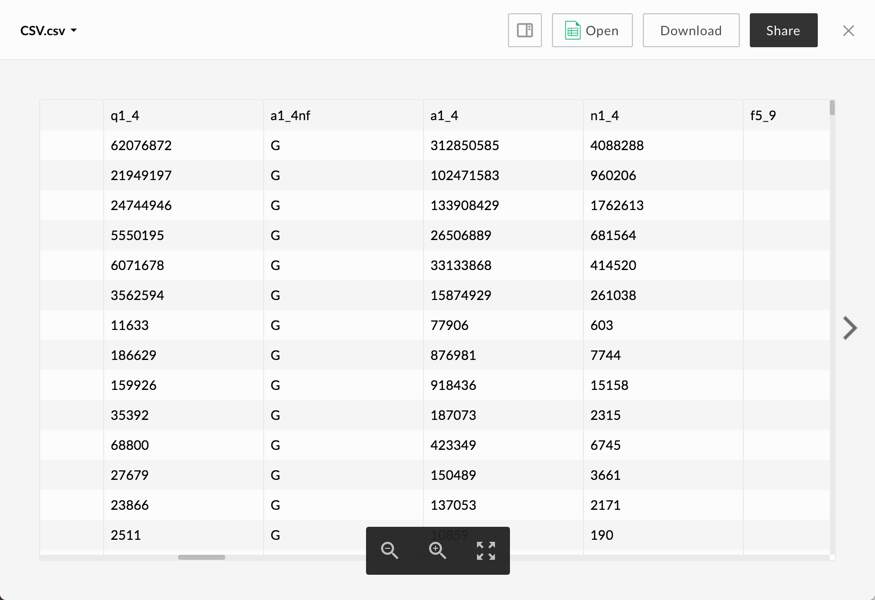

# CSV Viewer

The CSV viewer uses [PapaParse](https://github.com/mholt/PapaParse) to parse CSV and TSV files and [React Virtualized](https://github.com/bvaughn/react-virtualized) to display the parsed data in a table.

## Screenshot

## Behavior

Resizing the viewer window will cause the table to resize, and the zoom in and out buttons will increase and decrease font size respectively. Currently, column and row sizes are fixed and overflowing text will be truncated.

This viewer does not support printing.

### Controls:

* Zoom In
* Zoom Out
* Fullscreen (can be exited with the escape key)

## Supported File Extensions

`csv, tsv`

## Events
The CSV viewer fires the following events

| Event Name | Explanation | Event Data |
| --- | --- | --- |
| destroy | The preview is intentionally destroyed ||
| load |  The preview loads | 1. {string} **error** (optional): error message 2. {object} **file**: current file 3. {object} **metrics**: information from the logger 4. {object} **viewer**: current viewer |
| notification | A notification is displayed ||
| navigate | The preview is shown for a given index | {object} file |
| reload | The preview reloads ||
| resize | The preview resizes | 1. {number} **height**: window height 2. {number} **width**: window width |
| zoom | The preview zooms in or out | 1. {number} **zoom**: new zoom value 2. {boolean} **canZoomIn**: true if the viewer can zoom in more 3. {boolean} **canZoomOut**: true if the viewer can zoom out more |
