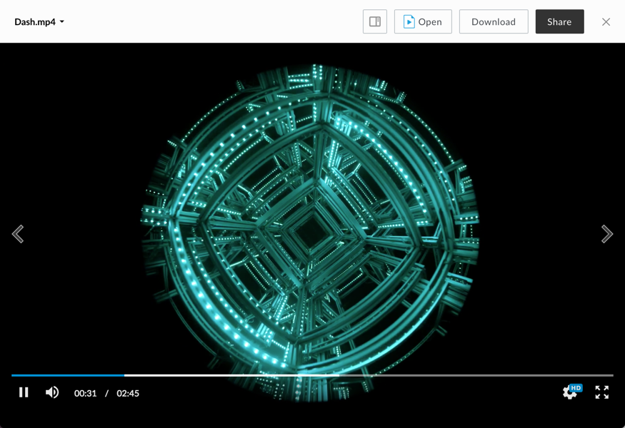

# Dash Viewer

The dash viewer renders previews for video files using [shaka player](https://github.com/google/shaka-player).

## Screenshot

## Behavior

The dash viewer uses a black background to create a better viewing experience. Video is streamed in chunks of ____ at an initial quality determined automatically. Volume can be muted or unmuted by clicking the volume icon, or changed by dragging the volume scrubber. The position of the video can be changed by clicking or dragging the playback scrubber.

### Controls:

* Play/Pause
* Volume
* Settings
* Fullscreen (can be exited with the escape key)

### Settings (cog icon in toolbar):

* video speed values: 0.25, 0.5, normal (1), 1.25, 1.5, 2.0
* video quality values: 480p, 1080p, auto

## Supported File Extensions

`3g2, 3gp, avi, m2v, m2ts, m4v, mkv, mov, mp4, mpeg, mpg, ogg, mts, qt, wmv`
