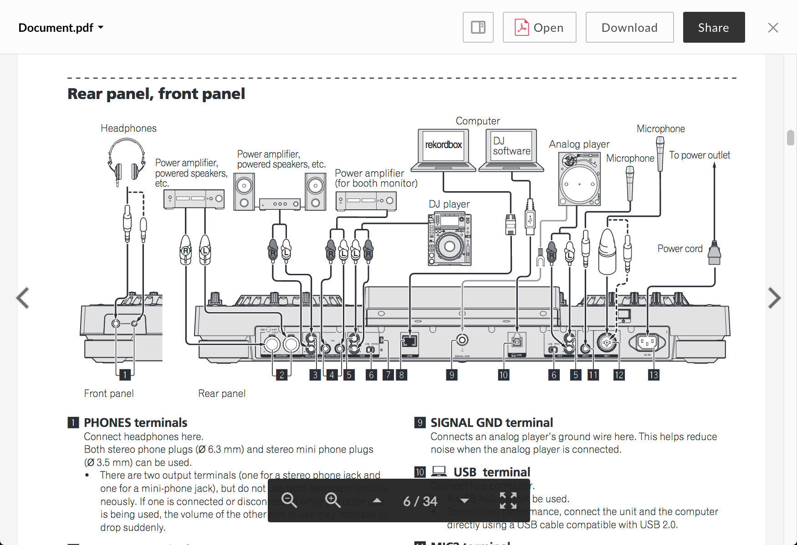

# Document Viewer

The document viewer renders previews for a variety of document types.

## Screenshot

## Behavior

The document viewer remembers which page you were viewing upon closing the preview. The next time that file is opened, you will immediately be brought to that page. Resizing the viewer window will cause the document to resize.

### Controls:

* Zoom In
* Zoom Out
* Set Page: either with the up and down arrows, or by clicking the page number and entering text
* Fullscreen (can be exited with the escape key)

## Supported File Extensions

`as, as3, asm, bat, c, cc, cmake, cpp, cs, css, csv, cxx, diff, doc, docx, erb, gdoc, groovy, gsheet, h, haml, hh, htm, html, java, js, less, log, m, make, md, ml, mm, msg, odp, ods, odt, pdf, php, pl, plist, ppt, pptx, properties, py, rb, rst, rtf, sass, scala, scm, script, sh, sml, sql, tsv, txt, vi, vim, webdoc, wpd, xhtml, xls, xlsm, xlsx, xml, xsd, xsl, yaml`

## Options

| Option | Type | Description |
| --- | --- | --- |
| annotations | boolean | Optional. Whether annotations on content are shown. Defaults  to false |
