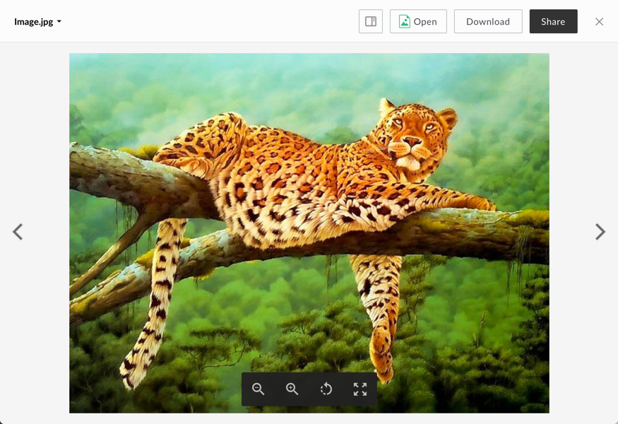

# Image Viewer

The image viewer renders previews of image files.

## Screenshot

## Behavior
Rotating the viewer will rotate the image 90 degrees clockwise. At the default zoom level, clicking on the image will zoom in once. When zoomed in, clicking on the document will return to the default zoom level. When zoomed out, clicking on the document will zoom in until the original zoom level is reached.

### Controls:
* Zoom In
* Zoom Out
* Rotate
* Fullscreen: can be exited with the escape key

## Supported File Extensions

`ai, bmp, dcm, eps, gif, png, ps, psd, svs, tga, tif, tiff`

## Options

| Option | Type | Description |
| --- | --- | --- |
| annotations | boolean | Optional. Whether annotations on content are shown. Defaults to false |
