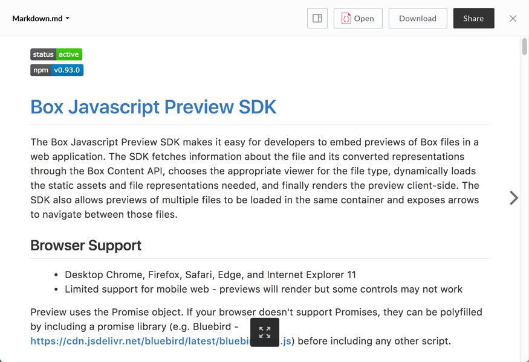

# Markdown Viewer

The Markdown viewer uses [Remarkable] (https://github.com/jonschlinkert/remarkable) to parse markdown files and [highlight.js] (https://github.com/isagalaev/highlight.js) to add syntax highlighting to code blocks contained within.

## Screenshot

## Behavior

The Markdown viewer parses the first 192KB of raw markdown in the file and renders it using Github's Markdown style. Additional content is truncated and a notification along with a download button are appended to the bottom of the preview.

The viewer supports GFM (Github Flavored Markdown) as defined in https://guides.github.com/features/mastering-markdown/, including tables, syntax highlighting, and automatic URL linking.

Re-sizing the viewer window will reflow the markdown to fit the available space. Also, this viewer supports printing and will attempt to print the parsed markdown and with syntax highlighting on code when either `print()` is invoked or the print button is pressed. Note that printing large files may cause some browsers to hang for a few seconds.

### Controls:

* Fullscreen (can be exited with the escape key)

## Supported File Extensions

`md`

## Events
The Markdown viewer fires the following events

| Event Name | Explanation | Event Data |
| --- | --- | --- |
| destroy | The preview is intentionally destroyed ||
| load |  The preview loads | <ul> <li> {string} **error** (optional): error message </li> <li> {object} **file**: current file </li> <li> {object} **metrics**: information from the logger </li> <li> {object} **viewer**: current viewer </li> </ul> |
| notification | A notification is displayed ||
| navigate | The preview is shown for a given index | <ul> <li> {object} file </li> </ul> |
| reload | The preview reloads ||
| resize | The preview resizes |<ul> <li> {number} **height**: window height </li> <li> {number} **width**: window width </li> </ul> |
| scrollstart | The viewer starts to scroll | <ul> <li> {number} **scrollTop**: number of pixels scrolled from top of viewport </li> <li> {number} **scrollLeft**: number of pixels scrolled from left of viewport </li> </ul> |
| scrollend | The viewer stops scrolling | <ul> <li> {number} **scrollTop**: number of pixels scrolled from top of viewport </li> <li> {number} **scrollLeft**: number of pixels scrolled from left of viewport </li> </ul> |
| printsuccess | An attempt to print triggered successfully ||
