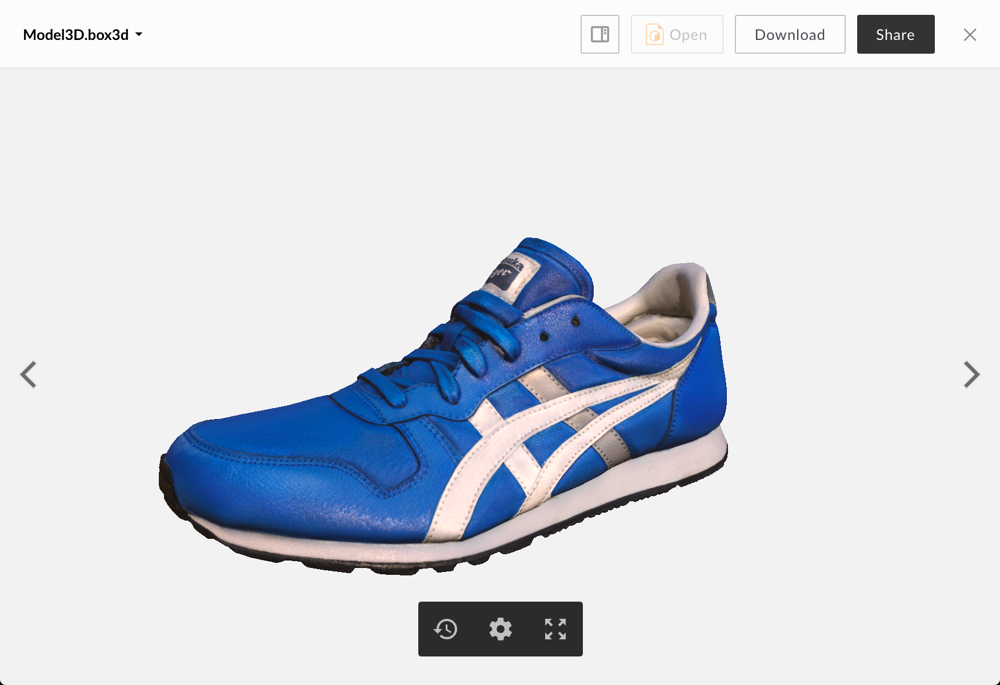

# Model3D Viewer

The Model3D viewer renders previews of 3d model files and allows you to enable different rendering modes to inspect various aspects of the model. e.g. wireframe, texture coords, etc. Animation data is also supported for files that contain it (e.g. box3d, fbx, dae).

## Screenshot

## Behavior

The Model3D viewer gives you an interactive view of the model. The left mouse button allows you to orbit about the model (single touch on touch-enabled device). Double-clicking somewhere on the model allows you to change orbit focus.

### Controls:

* Zoom (change distance to the model) with the mouse wheel (or two-finger scroll on a touch-enabled device).
* Pan (lateral movement) with the right mouse button (or three-finger swipe on a touch-enabled device).
* Animation Selection: If the model that is being viewed contains animations, two animation buttons will be visible in the toolbar. The first allows you to play and pause the animation and the second allows the selection of the current animation.
* VR button: If using a browser that supports WebVR and a suitable VR device is attached to your computer, the VR button will allow toggling in and out of VR mode.

### Settings (cog icon in toolbar):

* Render Mode: Lit, Unlit, Normals, Shape, UV Overlay
* Toggle Wireframe
* Toggle Skeleton
* Camera Projection: Perspective, Orthographic
* Render Quality: Auto, Full
* Rotate Model: X, Y, Z

## Box3D Packages

Preview gives users the ability to view a single file within Box so, by default, you can't view textures on your model. However, the Box web application gives users the ability to create a Box3D package that combines all dependent files into a single file that can be shared and previewed. To do this, right-click the model file within Box and choose "Create 3D Package". All referenced files found within Box will be included in the resulting package.

## Supported File Extensions

`box3d, fbx, dae, 3ds, obj, stl, ply`

## Events
The Model3D viewer fires the following events

| Event Name | Explanation | Event Data |
| --- | --- | --- |
| destroy | The preview is intentionally destroyed ||
| load |  The preview loads | <ul> <li> {string} **error** (optional): error message </li> <li> {object} **file**: current file </li> <li> {object} **metrics**: information from the logger </li> <li> {object} **viewer**: current viewer </li> </ul> |
| notification | A notification is displayed ||
| navigate | The preview is shown for a given index | <ul> <li> {object} file </li> </ul> |
| reload | The preview reloads ||
| resize | The preview resizes |<ul> <li> {number} **height**: window height </li> <li> {number} **width**: window width </li> </ul> |
