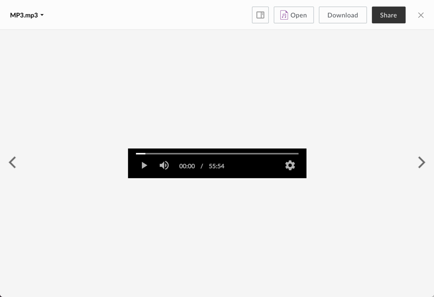

# MP3 Viewer

the MP3 viewer displays previews for audio files.

## Screenshot

## Behavior
Volume can be muted or unmuted by clicking the volume icon, or changed by dragging the volume scrubber. The position of the audio can be changed by clicking or dragging the playback scrubber.

### Controls:
* Play/Pause
* Volume
* Settings

###Settings (cog icon in toolbar):

* Audio Speed: 0.25, 0.5, normal (1), 1.25, 1.5, 2.0

## Supported File Extensions

`aac, aif, aifc, aiff, amr, au, flac, m4a, mp3, ra, wav, wma`
