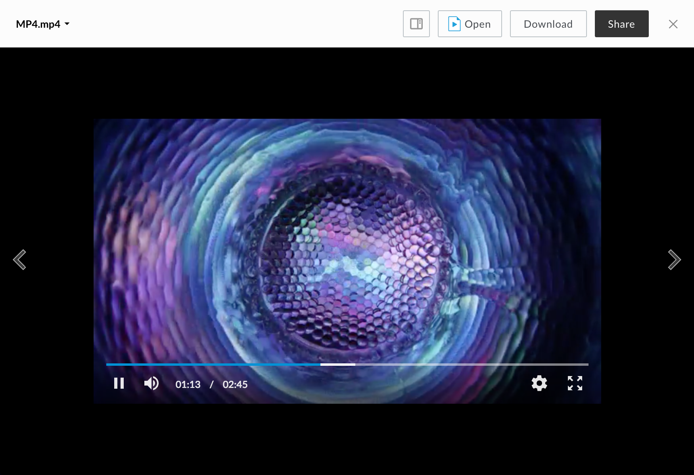

# MP4 Viewer

The MP4 viewer renders previews for video files

## Screenshot

## Behavior

The mp4 viewer uses a black background to create a better viewing experience. Volume can be muted or unmuted by clicking the volume icon, or changed by dragging the volume scrubber. The position of the video can be changed by clicking or dragging the playback scrubber.

### Controls:

* Play/Pause
* Volume
* Settings
* Fullscreen (can be exited with the escape key)

### Settings (cog icon in toolbar):

* video speed values: 0.25, 0.5, normal (1), 1.25, 1.5, 2.0

## Supported File Extensions

`3g2, 3gp, avi, m2v, m2ts, m4v, mkv, mov, mp4, mpeg, mpg, ogg, mts, qt, wmv`

## Events
The MP4 viewer fires the following events

| Event Name | Explanation | Event Data |
| --- | --- | --- |
| destroy | The preview is intentionally destroyed ||
| load |  The preview loads | <ul> <li> **error** (optional): error message </li> <li> **file**: current file </li> <li> **metrics**: information from the logger </li> <li> **viewer**: current viewer </li> </ul> |
| notification | A notification is displayed ||
| navigate | The preview is shown for a given index | <ul> <li> **file**: current file </li> </ul> |
| reload | The preview reloads ||
| resize | The preview resizes |<ul> <li> **height**: window height </li> <li> **width**: window width </li> </ul> |
| speedchange | Media speed changes | <ul> <li> {string} playback speed </li> </ul> |
| play | The video plays ||
| pause | The video pauses ||
| seek | The video skips to a time | <ul> <li> {number} time </li> </ul> |
