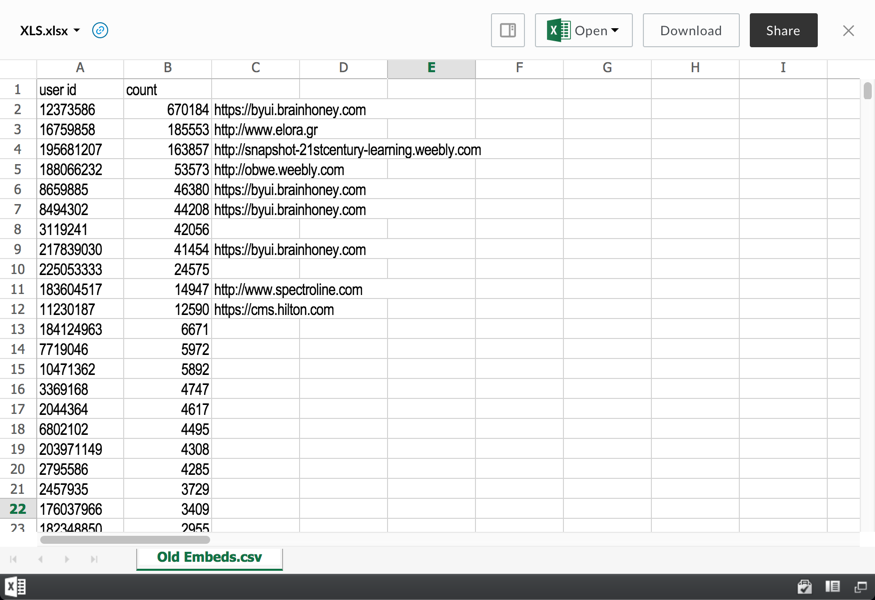

# Office Viewer

The Office viewer renders previews of Microsoft Office documents by embedding an iframe of Microsoft's Office Online viewer.

## Screenshot

## Behavior

The Office viewer currently supports previews of Excel files using Microsoft Office Online from within the Box Web Application. Support for platform use cases and other Office file formats is in progress.

There are several limitations at the moment:
- File must be downloadable
- File size cannot be greater than 5MB
- File cannot be shared via a Box shared link with a password (shared links without passwords are okay)

## Supported File Extensions

`xlsx`

## Events
The Office viewer fires the following events

| Event Name | Explanation | Event Data |
| --- | --- | --- |
| destroy | The preview is intentionally destroyed ||
| load |  The preview loads | <ul> <li> {string} **error** (optional): error message </li> <li> {object} **file**: current file </li> <li> {object} **metrics**: information from the logger </li> <li> {object} **viewer**: current viewer </li> </ul> |
| notification | A notification is displayed ||
| navigate | The preview is shown for a given index | <ul> <li> {object} file </li> </ul> |
| reload | The preview reloads ||
| resize | The preview resizes |<ul> <li> {number} **height**: window height </li> <li> {number} **width**: window width </li> </ul> |
