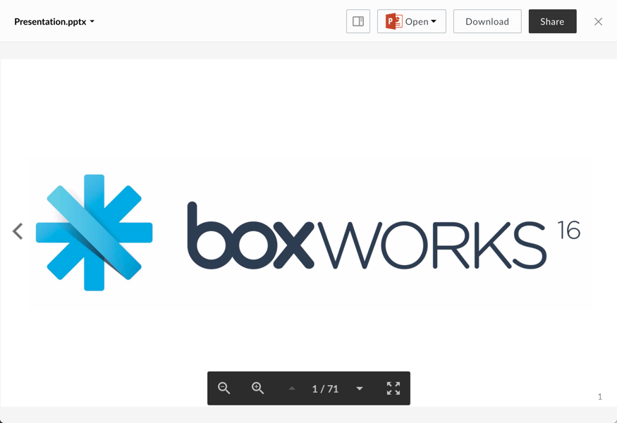

# Presentation Viewer

The presentation viewer renders previews of powerpoint files.

## Screenshot

## Behavior

The presentation viewer remembers which slide you were viewing upon closing the preview. The next time that file is opened, you will immediately be brought to that page. Scrolling the mouse up and down, or swiping up and down on mobile will transition between slides. Zooming in or out will increase or decrease the size of the slide respectively. If the zoom level causes the content to overflow, scrolling the mouse will allow you to scroll around the slide. To return to normal scrolling behavior, the user must zoom out until the overflow is removed.

### Controls:
* Zoom In
* Zoom Out
* Set Page: either with the up and down arrows, or by clicking the page number and entering text
* Fullscreen: can be exited with the escape key

## Supported File Extensions

`ppt, pptx, odp`

## Options

| Option | Type | Description |
| --- | --- | --- |
| annotations | boolean | Optional. Whether annotations on content are shown. Defaults  to false |
