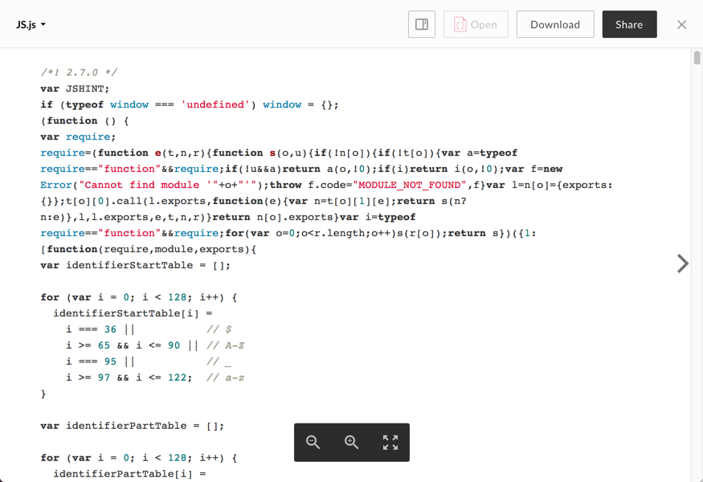

# Text Viewer

The text viewer renders previews of text files and uses [highlight.js] (https://github.com/isagalaev/highlight.js) to add syntax highlighting to code files.

## Screenshot

## Behavior

The text viewer displays the first 192KB of text in the file. Additional text is truncated and a notification and download button are appended to the bottom of the preview.

Re-sizing the viewer window will reflow the text to fit the available space and the zoom in and out buttons will increase and decrease font size respectively.

This viewer supports printing and will attempt to print with appropriate syntax highlighting when either `print()` is invoked or the print button is pressed. Note that printing large files may cause some browsers to hang for a few seconds.

### Controls:
* Zoom In
* Zoom Out
* Fullscreen: can be exited with the escape key

## Supported File Extensions

`as, as3, asm, bat, c, cc, cmake, cpp, cs, css, cxx, diff, erb, groovy, h, haml, hh, htm, html, java, js, less, m, make, md, ml, mm, php, pl, plist, properties, py, rb, rst, sass, scala, script, scm, sml, sql, sh, vi, vim, webdoc, xhtml, yaml`
