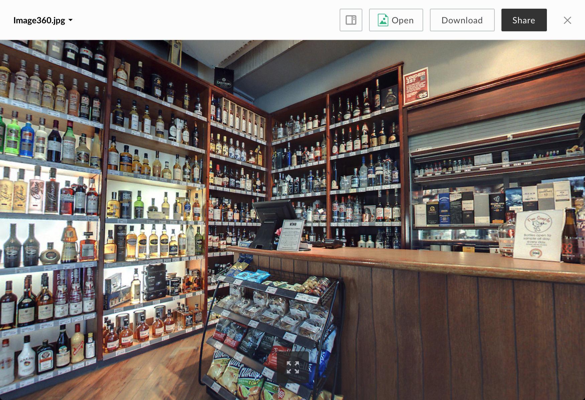

# 360 Image Viewer

The 360 image viewer renders a preview of an image stored as an equirectangular projection (often taken with a special camera).

## Screenshot

## Behavior

This viewer gives you an interactive view of a 360 degree image. First, a low resolution version of the image is loaded to give a quick view before the full resolution image is finished loading. Clicking and dragging with the left mouse button will change the view direction (single touch and drag on touch-enabled device).

### Controls:

* Fullscreen (can be exited with the escape key)
* VR Button: When using a browser that supports WebVR and a suitable VR device is attached to your computer, a VR button will be available to allow toggling in and out of VR mode.

## Limitations

Currently, this previewer requires that the file be named with a '.360' preceding the file extension. This is so that Preview SDK knows to run this viewer rather than the standard image viewer.

## Supported File Extensions

`'360.jpg', '360.jpeg', '360.png'`

## Events

The 360 image viewer fires the following events

| Event Name | Explanation | Event Data |
| --- | --- | --- |
| destroy | The preview is intentionally destroyed ||
| load |  The preview loads | 1. {string} **error** (optional): error message 2. {object} **file**: current file 3. {object} **metrics**: information from the logger 4. {object} **viewer**: current viewer |
| notification | A notification is displayed ||
| navigate | The preview is shown for a given index | {object} file |
| reload | The preview reloads ||
| resize | The preview resizes | 1. {number} **height**: window height 2. {number} **width**: window width |
| assetsloaded | The viewer's third party assets have loaded ||

## Methods

The following methods are available for the 360 image viewer.
| Method Name | Explanation | Method Parameters |
| toggleFullscreen | Toggles fullscreen mode ||
