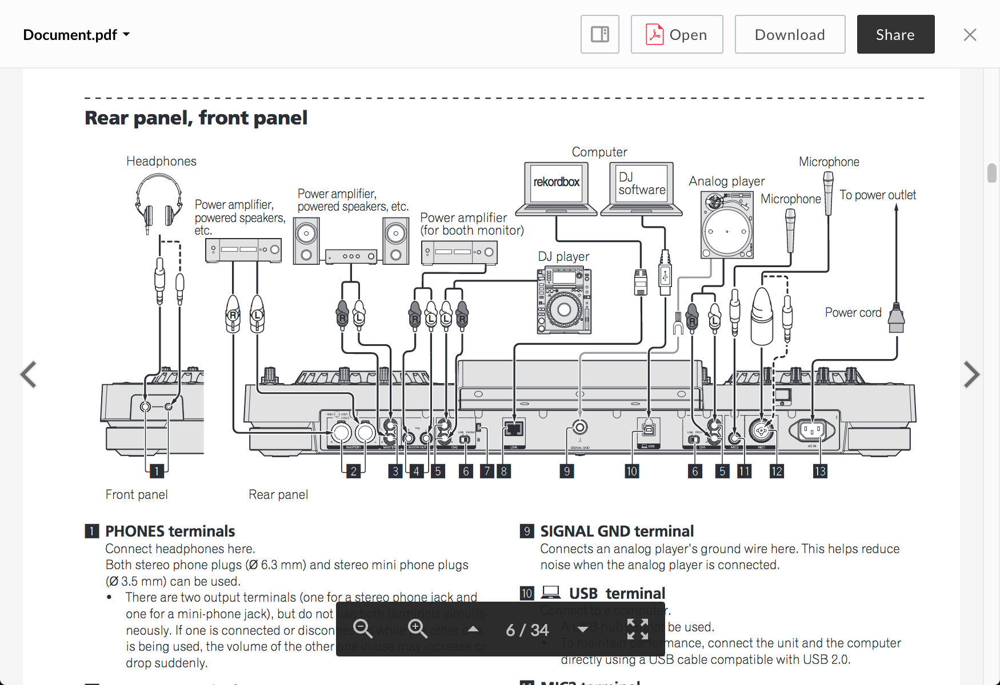
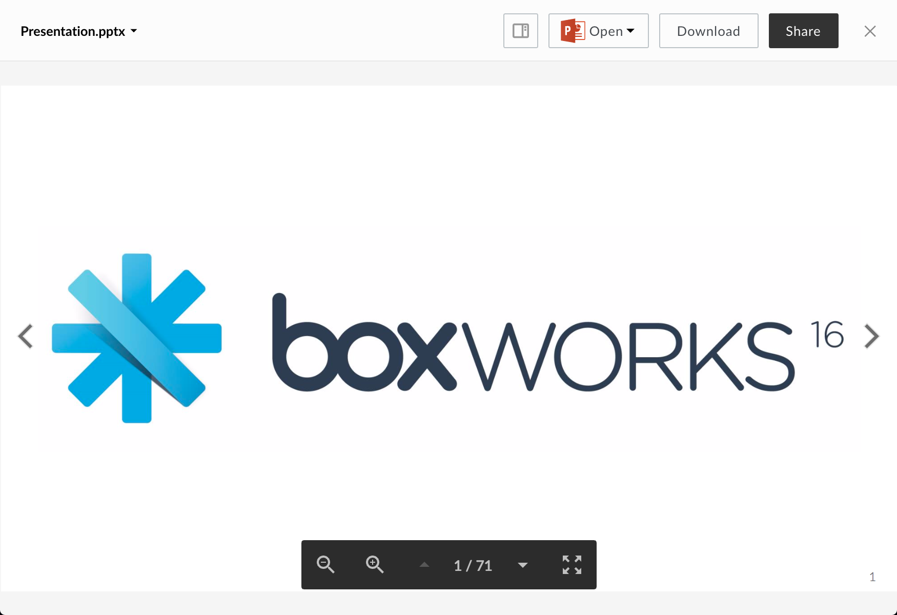

# Document Viewer

The document viewer renders previews for a variety of document types.

## Screenshot

## Behavior

The document viewer remembers which page you were viewing upon closing the preview. The next time that file is opened, you will immediately be brought to that page. Resizing the viewer window will cause the document to resize.

### Controls:

* Zoom In
* Zoom Out
* Set Page: either with the up and down arrows, or by clicking the page number and entering text
* Fullscreen (can be exited with the escape key)

## Supported File Extensions

`as, as3, asm, bat, c, cc, cmake, cpp, cs, css, csv, cxx, diff, doc, docx, erb, gdoc, groovy, gsheet, h, haml, hh, htm, html, java, js, less, log, m, make, md, ml, mm, msg, odp, ods, odt, pdf, php, pl, plist, ppt, pptx, properties, py, rb, rst, rtf, sass, scala, scm, script, sh, sml, sql, tsv, txt, vi, vim, webdoc, wpd, xhtml, xls, xlsm, xlsx, xml, xsd, xsl, yaml`

## Options

| Option | Type | Description |
| --- | --- | --- |
| annotations | boolean | Optional. Whether annotations on content are shown. Defaults  to false |

## Events
The document viewer fires the following events

| Event Name | Explanation | Event Data |
| --- | --- | --- |
| destroy | The preview is intentionally destroyed ||
| load |  The preview loads | 1. {string} **error** (optional): error message 2. {object} **file**: current file 3. {object} **metrics**: information from the logger 4. {object} **viewer**: current viewer |
| notification | A notification is displayed ||
| navigate | The preview is shown for a given index | {object} file |
| reload | The preview reloads ||
| resize | The preview resizes | 1. {number} **height**: window height 2. {number} **width**: window width |
| zoom | The preview zooms in or out | 1. {number} **newScale**: new zoom value 2. {boolean} **canZoomIn**: true if the viewer can zoom in more 3. {boolean} **canZoomOut**: true if the viewer can zoom out more |
| pagerendered | A page is rendered | {number} page number of rendered page |
| pagefocus | A page is visible | {number} page number of focused page |
| scrollstart | The viewer starts to scroll | 1. {number} **scrollTop**: number of pixels scrolled from top of viewport 2. {number} **scrollLeft**: number of pixels scrolled from left of viewport |
| scrollend | The viewer stops scrolling | 1. {number} **scrollTop**: number of pixels scrolled from top of viewport 2. {number} **scrollLeft**: number of pixels scrolled from left of viewport |
| printsuccess | An attempt to print triggered successfully ||
| printsuccess | An attempt to print failed ||

# Presentation Viewer

The presentation viewer renders previews of powerpoint files.

## Screenshot

## Behavior

The presentation viewer remembers which slide you were viewing upon closing the preview. The next time that file is opened, you will immediately be brought to that page. Scrolling the mouse up and down, or swiping up and down on mobile will transition between slides. Zooming in or out will increase or decrease the size of the slide respectively. If the zoom level causes the content to overflow, scrolling the mouse will allow you to scroll around the slide. To return to normal scrolling behavior, the user must zoom out until the overflow is removed.

### Controls:
* Zoom In
* Zoom Out
* Set Page: either with the up and down arrows, or by clicking the page number and entering text
* Fullscreen: can be exited with the escape key

## Supported File Extensions

`ppt, pptx, odp`

## Options

| Option | Type | Description |
| --- | --- | --- |
| annotations | boolean | Optional. Whether annotations on content are shown. Defaults  to false |

## Events
The presentation viewer fires the following events

| Event Name | Explanation | Event Data |
| --- | --- | --- |
| destroy | The preview is intentionally destroyed ||
| load |  The preview loads | 1. {string} **error** (optional): error message 2. {object} **file**: current file 3. {object} **metrics**: information from the logger 4. {object} **viewer**: current viewer |
| notification | A notification is displayed ||
| navigate | The preview is shown for a given index | {object} file |
| reload | The preview reloads ||
| resize | The preview resizes | 1. {number} **height**: window height 2. {number} **width**: window width |
| zoom | The preview zooms in or out | 1. {number} **zoom**: new zoom value 2. {boolean} **canZoomIn**: true if the viewer can zoom in more 3. {boolean} **canZoomOut**: true if the viewer can zoom out more |
| pagerendered | A page renders | {number} page number of rendered page |
| pagefocus | A page is visible | {number} page number of focused page |
| scrollstart | The viewer starts to scroll | 1. {number} **scrollTop**: number of pixels scrolled from top of viewport 2. {number} **scrollLeft**: number of pixels scrolled from left of viewport |
| scrollend | The viewer stops scrolling | 1. {number} **scrollTop**: number of pixels scrolled from top of viewport 2. {number} **scrollLeft**: number of pixels scrolled from left of viewport |
