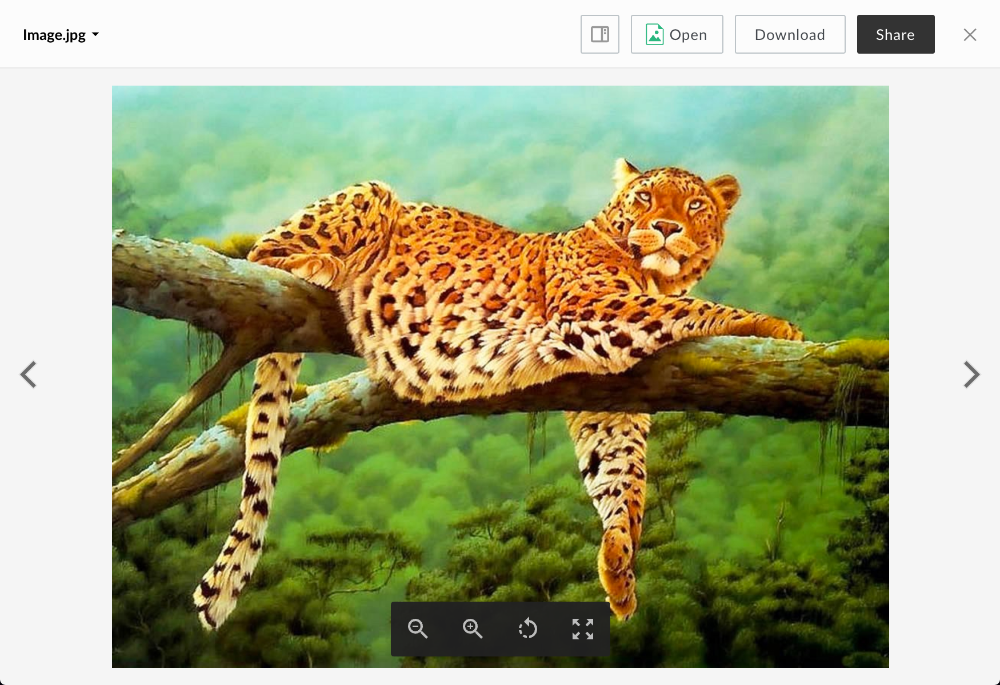
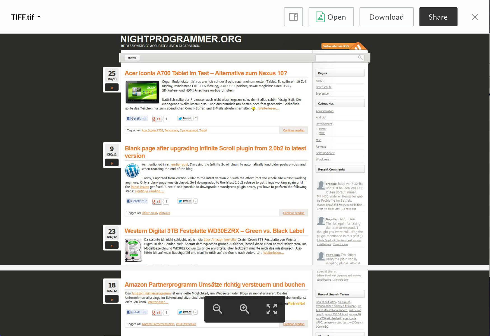

# Image Viewer

The image viewer renders previews of image files.

## Screenshot

## Behavior
Rotating the viewer will rotate the image 90 degrees clockwise. At the default zoom level, clicking on the image will zoom in once. When zoomed in, clicking on the document will return to the default zoom level. When zoomed out, clicking on the document will zoom in until the original zoom level is reached.

### Controls:
* Zoom In
* Zoom Out
* Rotate
* Fullscreen: can be exited with the escape key

## Supported File Extensions

`ai, bmp, dcm, eps, gif, png, ps, psd, svs, tga, tif, tiff`

## Options

| Option | Type | Description |
| --- | --- | --- |
| annotations | boolean | Optional. Whether annotations on content are shown. Defaults to false |

## Events
The image viewer fires the following events

| Event Name | Explanation | Event Data |
| --- | --- | --- |
| destroy | The preview is intentionally destroyed ||
| load |  The preview loads | 1. {string} **error** (optional): error message 2. {object} **file**: current file 3. {object} **metrics**: information from the logger 4. {object} **viewer**: current viewer |
| notification | A notification is displayed ||
| navigate | The preview is shown for a given index | {object} file |
| reload | The preview reloads ||
| resize | The preview resizes | 1. {number} **height**: window height 2. {number} **width**: window width |
| zoom | The preview zooms in or out | 1. {number} **zoom**: new zoom value 2. {boolean} **canZoomIn**: true if the viewer can zoom in more 3. {boolean} **canZoomOut**: true if the viewer can zoom out more |
| pan | The preview is panning ||
| panstart | Panning starts ||
| panend | Panning ends ||
| rotate | The image rotates ||
| printsuccess | An attempt to print triggered successfully ||

## Methods

The following methods are available for the image viewer.

| Method Name | Explanation | Method Parameters |
| --- | --- | --- |
| zoom | Zooms the image | {string} 'in', 'out', or 'reset' |
| print | Prints the image ||
| rotateLeft | Rotates the image counter-clockwise by 90 degrees ||
| isRotated | Determines if the image has been rotated 90 or 270 degrees ||
| toggleFullscreen | Toggles fullscreen mode ||

# Multi-Page Image Viewer

The multi-page image viewer renders previews of multi page image files.

## Screenshot

## Behavior
At the default zoom level, clicking on the image will zoom in once. When zoomed in, clicking on the document will return to the default zoom level. When zoomed out, clicking on the document will zoom in until the original zoom level is reached.

### Controls:
* Zoom In
* Zoom Out
* Set Page: either with the up and down arrows, or by clicking the page number and entering text
* Fullscreen: can be exited with the escape key

## Supported File Extensions

`tif, tiff`

## Options

| Option | Type | Description |
| --- | --- | --- |
| annotations | boolean | Optional. Whether annotations on content are shown. Defaults  to false |

## Events
The image viewer fires the following events

| Event Name | Explanation | Event Data |
| --- | --- | --- |
| destroy | The preview is intentionally destroyed ||
| load |  The preview loads | 1. {string} **error** (optional): error message 2. {object} **file**: current file 3. {object} **metrics**: information from the logger 4. {object} **viewer**: current viewer |
| notification | A notification is displayed ||
| navigate | The preview is shown for a given index | {object} file |
| reload | The preview reloads ||
| resize | The preview resizes | 1. {number} **height**: window height 2. {number} **width**: window width |
| zoom | The preview zooms in or out | 1. {number} **zoom**: new zoom value 2. {boolean} **canZoomIn**: true if the viewer can zoom in more 3. {boolean} **canZoomOut**: true if the viewer can zoom out more |
| pagefocus | A page is visible | {number} page number of focused page |
| pan | The preview is panning ||
| panstart | Panning starts ||
| panend | Panning ends ||

## Methods

The following methods are available for the multi-page image viewer.

| Method Name | Explanation | Method Parameters |
| --- | --- | --- |
| zoom | Zooms the image | {string} 'in', 'out', or 'reset' |
| previousPage | Navigates to the previous page ||
| nextPage | Navigates to the next page ||
| setPage | Navigates to a given page | {number} page number |
| toggleFullscreen | Toggles fullscreen mode ||
