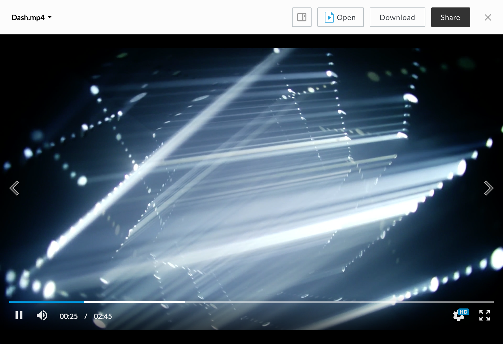
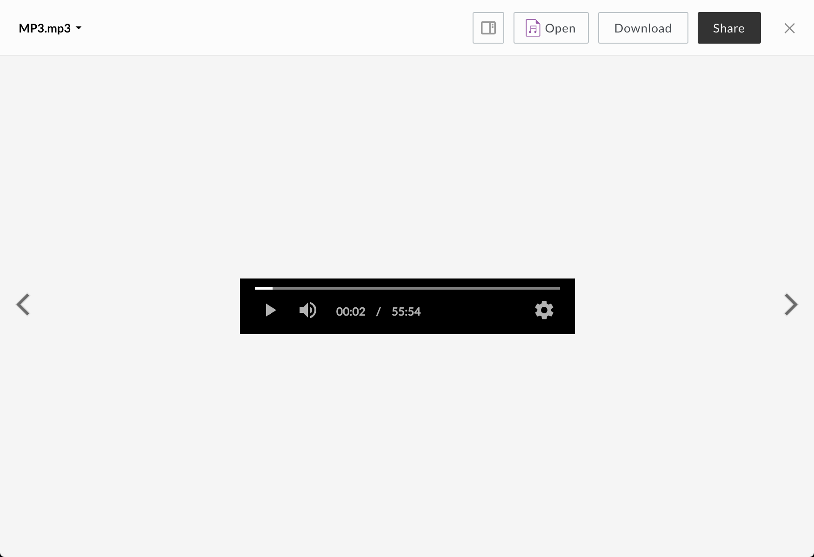
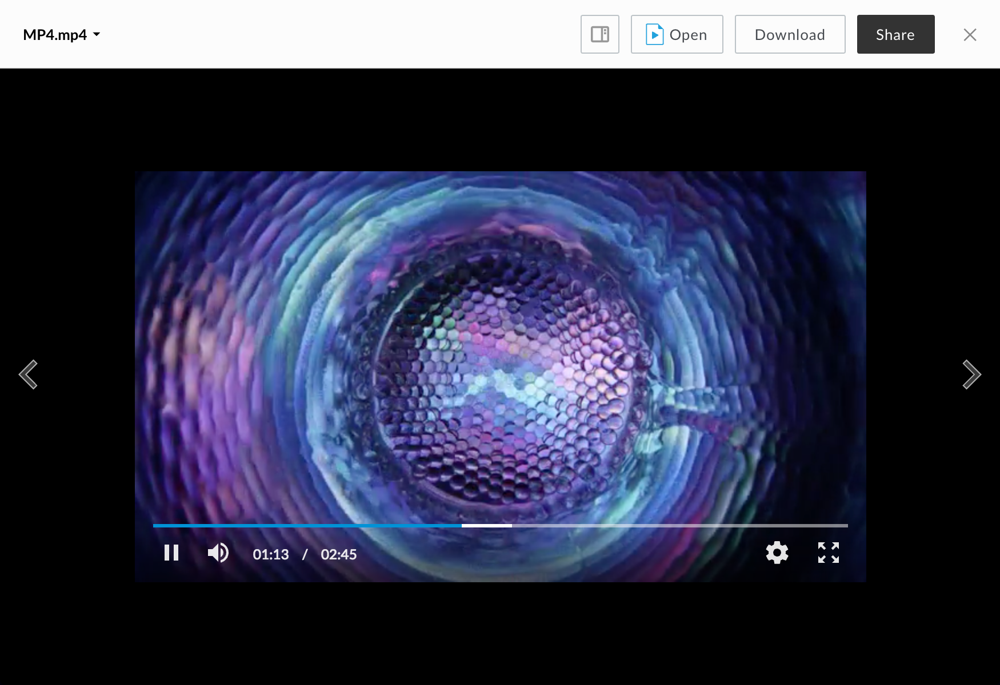

# DASH Viewer

The DASH viewer renders previews for video files using [shaka player](https://github.com/google/shaka-player).

## Screenshot

## Behavior

The DASH viewer uses a black background to create a more native viewing experience. Video is streamed in chunks of ____ at an initial quality determined automatically. Volume can be muted or unmuted by clicking the volume icon, or changed by dragging the volume scrubber. The position of the video can be changed by clicking or dragging the playback scrubber.

### Controls:

* Play/Pause
* Volume
* Settings
* Fullscreen (can be exited with the escape key)

### Settings (cog icon in toolbar):

* Video Speed: 0.25, 0.5, normal (1), 1.25, 1.5, 2.0
* Video Quality: 480p, 1080p, auto

## Supported File Extensions

`3g2, 3gp, avi, m2v, m2ts, m4v, mkv, mov, mp4, mpeg, mpg, ogg, mts, qt, wmv`

## Events

The DASH viewer fires the following events

| Event Name | Explanation | Event Data |
| --- | --- | --- |
| destroy | The preview is intentionally destroyed ||
| load |  The preview loads | 1. {string} **error** (optional): error message 2. {object} **file**: current file 3. {object} **metrics**: information from the logger 4. {object} **viewer**: current viewer |
| notification | A notification is displayed ||
| navigate | The preview is shown for a given index | {object} file |
| reload | The preview reloads ||
| resize | The preview resizes | 1. {number} **height**: window height 2. {number} **width**: window width |
| ratechange | The media speed changes | {string} playback speed |
| volumechange | The media volume changes | {number} volume between 0 and 1|
| qualitychange | The video quality changes | {string} media quality |
| bandwidthhistory | Gives bandwidth history when the preview is destroyed | {array} bandwidth information |
| switchhistory | Gives quality switching history when the preview is destroyed | {array} quality switch objects |
| adaptation | Quality adapts to a change in bandwidth | {number} bandwidth |
| play | The video plays ||
| pause | The video pauses ||
| seeked | The video skips to a time | {number} time |

## Methods

The following methods are available for the DASH viewer.

| Method Name | Explanation | Method Parameters |
| --- | --- | --- |
| setMediaTime | Updates the media element's time | {number} time in seconds |
| setVolume | Updates the media element's volume | {number} value between 0 and 1
| togglePlay | Toggles playback ||
| toggleMute | Toggles between mute and current volume value ||
| quickSeek | Seeks forward/backward from current point | {number} increment in seconds ||
| increaseVolume | Increases volume by a small increment ||
| decreaseVolume | Decreases volume by a small increment ||
| toggleFullscreen | Toggles fullscreen mode ||

# MP3 Viewer

the MP3 viewer displays previews for audio files.

## Screenshot

## Behavior
Volume can be muted or unmuted by clicking the volume icon, or changed by dragging the volume scrubber. The position of the audio can be changed by clicking or dragging the playback scrubber.

### Controls:
* Play/Pause
* Volume
* Settings

###Settings (cog icon in toolbar):

* Audio Speed: 0.25, 0.5, normal (1), 1.25, 1.5, 2.0

## Supported File Extensions

`aac, aif, aifc, aiff, amr, au, flac, m4a, mp3, ra, wav, wma`

## Events
The MP3 viewer fires the following events

| Event Name | Explanation | Event Data |
| --- | --- | --- |
| destroy | The preview is intentionally destroyed ||
| load |  The preview loads | 1. {string} **error** (optional): error message 2. {object} **file**: current file 3. {object} **metrics**: information from the logger 4. {object} **viewer**: current viewer |
| notification | A notification is displayed ||
| navigate | The preview is shown for a given index | {object} file |
| reload | The preview reloads ||
| resize | The preview resizes | 1. {number} **height**: window height 2. {number} **width**: window width |
| ratechange | Media speed changes | {string} playback speed |
| volumechange | The media volume changes | {number} volume between 0 and 1|
| play | The audio plays ||
| pause | The audio pauses ||
| seeked | The audio skips to a time | {number} time |

## Methods

The following methods are available for the MP3 viewer.

| Method Name | Explanation | Method Parameters |
| --- | --- | --- |
| setMediaTime | Updates the media element's time | {number} time in seconds |
| setVolume | Updates the media element's volume | {number} value between 0 and 1
| togglePlay | Toggles playback ||
| toggleMute | Toggles between mute and current volume value ||
| quickSeek | Seeks forward/backward from current point | {number} increment in seconds ||
| increaseVolume | Increases volume by a small increment ||
| decreaseVolume | Decreases volume by a small increment ||

# MP4 Viewer

The MP4 viewer renders previews for video files

## Screenshot

## Behavior

The mp4 viewer uses a black background to create a better viewing experience. Volume can be muted or unmuted by clicking the volume icon, or changed by dragging the volume scrubber. The position of the video can be changed by clicking or dragging the playback scrubber.

### Controls:

* Play/Pause
* Volume
* Settings
* Fullscreen (can be exited with the escape key)

### Settings (cog icon in toolbar):

* video speed values: 0.25, 0.5, normal (1), 1.25, 1.5, 2.0

## Supported File Extensions

`3g2, 3gp, avi, m2v, m2ts, m4v, mkv, mov, mp4, mpeg, mpg, ogg, mts, qt, wmv`

## Events

The MP4 viewer fires the following events

| Event Name | Explanation | Event Data |
| --- | --- | --- |
| destroy | The preview is intentionally destroyed ||
| load |  The preview loads | 1. {string} **error** (optional): error message 2. {object} **file**: current file 3. {object} **metrics**: information from the logger 4. {object} **viewer**: current viewer |
| notification | A notification is displayed ||
| navigate | The preview is shown for a given index | {object} file |
| reload | The preview reloads ||
| resize | The preview resizes | 1. {number} **height**: window height 2. {number} **width**: window width |
| ratechange | Media speed changes | {string} playback speed |
| volumechange | The media volume changes | {number} volume between 0 and 1 |
| play | The video plays ||
| pause | The video pauses ||
| seeked | The video skips to a time | {number} time |

## Methods

See DASH viewer methods
