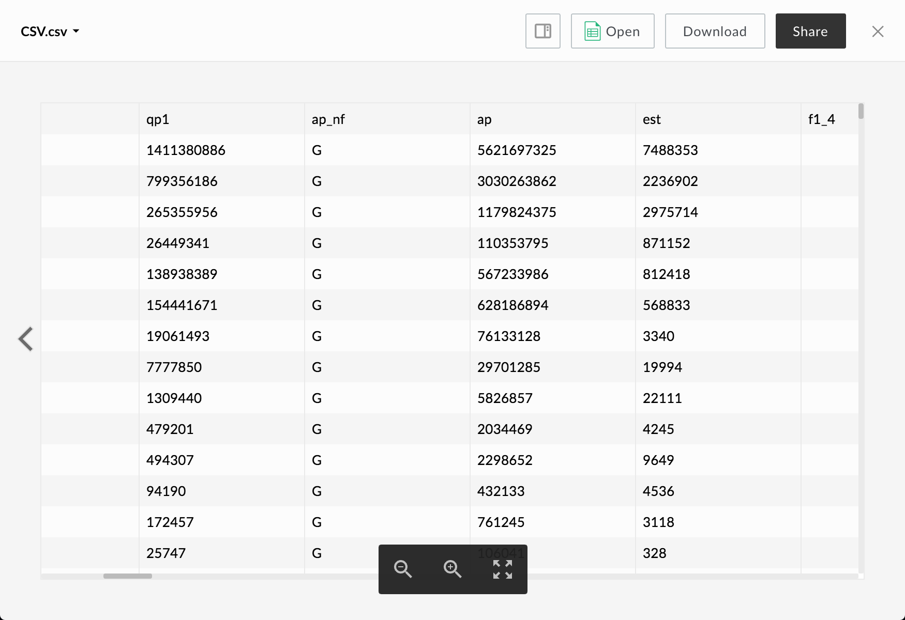
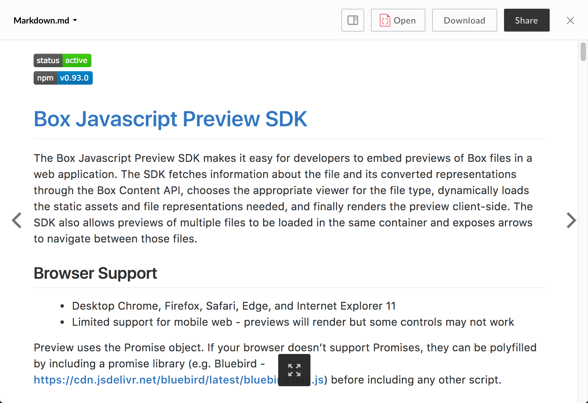
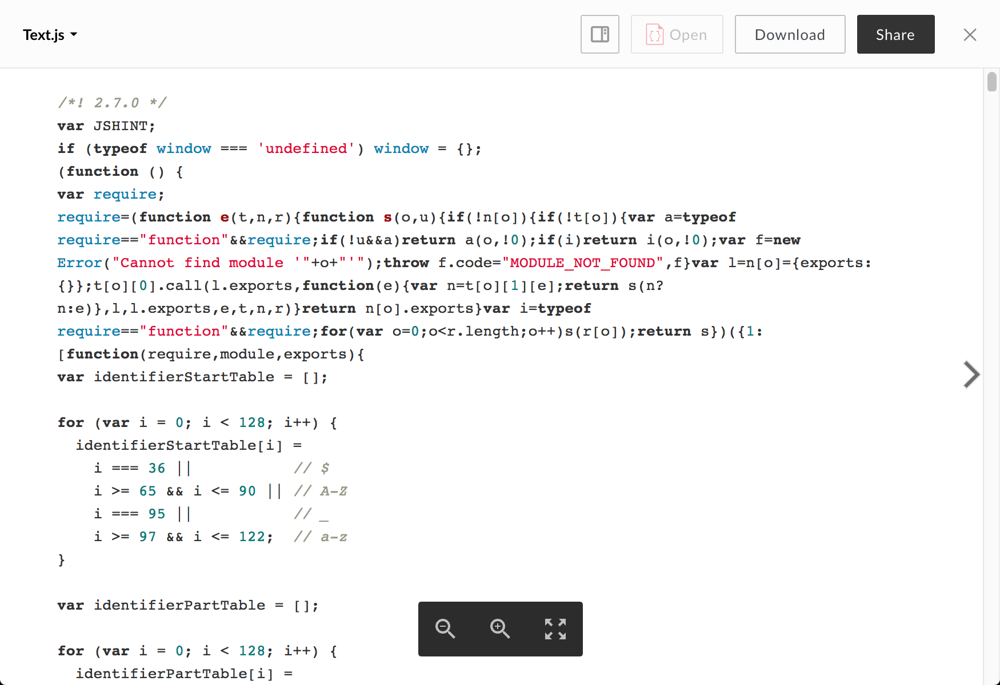

# CSV Viewer

The CSV viewer uses [PapaParse](https://github.com/mholt/PapaParse) to parse CSV and TSV files and [React Virtualized](https://github.com/bvaughn/react-virtualized) to display the parsed data in a table.

## Screenshot

## Behavior

Resizing the viewer window will cause the table to resize, and the zoom in and out buttons will increase and decrease font size respectively. Currently, column and row sizes are fixed and overflowing text will be truncated.

This viewer does not support printing.

### Controls:

* Zoom In
* Zoom Out
* Fullscreen (can be exited with the escape key)

## Supported File Extensions

`csv, tsv`

## Events

The CSV viewer fires the following events

| Event Name | Explanation | Event Data |
| --- | --- | --- |
| destroy | The preview is intentionally destroyed ||
| load |  The preview loads | 1. {string} **error** (optional): error message 2. {object} **file**: current file 3. {object} **metrics**: information from the logger 4. {object} **viewer**: current viewer |
| notification | A notification is displayed ||
| navigate | The preview is shown for a given index | {object} file |
| reload | The preview reloads ||
| resize | The preview resizes | 1. {number} **height**: window height 2. {number} **width**: window width |
| zoom | The preview zooms in or out | 1. {number} **zoom**: new zoom value 2. {boolean} **canZoomIn**: true if the viewer can zoom in more 3. {boolean} **canZoomOut**: true if the viewer can zoom out more |

## Methods

The following methods are available for the CSV viewer.

| Method Name | Explanation | Method Parameters |
| --- | --- | --- |
| zoom | Zooms in or out based on the given value | {string} 'in' or 'out' |
| zoomIn | Zooms in ||
| zoomOut | Zooms out ||
| toggleFullscreen | Toggles fullscreen mode ||

# Markdown Viewer

The Markdown viewer uses [Remarkable] (https://github.com/jonschlinkert/remarkable) to parse markdown files and [highlight.js] (https://github.com/isagalaev/highlight.js) to add syntax highlighting to code blocks contained within.

## Screenshot

## Behavior

The Markdown viewer parses the first 192KB of raw markdown in the file and renders it using Github's Markdown style. Additional content is truncated and a notification along with a download button are appended to the bottom of the preview.

The viewer supports GFM (Github Flavored Markdown) as defined in https://guides.github.com/features/mastering-markdown/, including tables, syntax highlighting, and automatic URL linking.

Re-sizing the viewer window will reflow the markdown to fit the available space. Also, this viewer supports printing and will attempt to print the parsed markdown and with syntax highlighting on code when either `print()` is invoked or the print button is pressed. Note that printing large files may cause some browsers to hang for a few seconds.

### Controls:

* Fullscreen (can be exited with the escape key)

## Supported File Extensions

`md`

## Events

The Markdown viewer fires the following events

| Event Name | Explanation | Event Data |
| --- | --- | --- |
| destroy | The preview is intentionally destroyed ||
| load |  The preview loads | 1. {string} **error** (optional): error message 2. {object} **file**: current file 3. {object} **metrics**: information from the logger 4. {object} **viewer**: current viewer |
| notification | A notification is displayed ||
| navigate | The preview is shown for a given index | {object} file |
| reload | The preview reloads ||
| resize | The preview resizes | 1. {number} **height**: window height 2. {number} **width**: window width |
| printsuccess | An attempt to print triggered successfully ||

## Methods

The following methods are available for the Markdown viewer.

| Method Name | Explanation | Method Parameters |
| --- | --- | --- |
| print | Prints text using Github Markdown styling ||
| toggleFullscreen | Toggles fullscreen mode ||

# Text Viewer

The text viewer renders previews of text files and uses [highlight.js] (https://github.com/isagalaev/highlight.js) to add syntax highlighting to code files.

## Screenshot

## Behavior

The text viewer displays the first 192KB of text in the file. Additional text is truncated and a notification and download button are appended to the bottom of the preview.

Re-sizing the viewer window will reflow the text to fit the available space and the zoom in and out buttons will increase and decrease font size respectively.

This viewer supports printing and will attempt to print with appropriate syntax highlighting when either `print()` is invoked or the print button is pressed. Note that printing large files may cause some browsers to hang for a few seconds.

### Controls:

* Zoom In
* Zoom Out
* Fullscreen: can be exited with the escape key

## Supported File Extensions

`as, as3, asm, bat, c, cc, cmake, cpp, cs, css, cxx, diff, erb, groovy, h, haml, hh, htm, html, java, js, less, m, make, md, ml, mm, php, pl, plist, properties, py, rb, rst, sass, scala, script, scm, sml, sql, sh, vi, vim, webdoc, xhtml, yaml`

## Events

The text viewer fires the following events

| Event Name | Explanation | Event Data |
| --- | --- | --- |
| destroy | The preview is intentionally destroyed ||
| load |  The preview loads | 1. {string} **error** (optional): error message 2. {object} **file**: current file 3. {object} **metrics**: information from the logger 4. {object} **viewer**: current viewer |
| notification | A notification is displayed ||
| navigate | The preview is shown for a given index | {object} file |
| reload | The preview reloads ||
| resize | The preview resizes | 1. {number} **height**: window height 2. {number} **width**: window width |
| zoom | The preview zooms in or out | 1. {number} **zoom**: new zoom value 2. {boolean} **canZoomIn**: true if the viewer can zoom in more 3. {boolean} **canZoomOut**: true if the viewer can zoom out more |
| printsuccess | An attempt to print triggered successfully ||

## Methods

The following methods are available for the text viewer.
| Method Name | Explanation | Method Parameters |
| --- | --- | --- |
| zoom | Zooms in or out based on the given value | {string} 'in' or 'out' |
| zoomIn | Zooms in ||
| zoomOut | Zooms out ||
| print | Prints text ||
| toggleFullscreen | Toggles fullscreen mode ||
